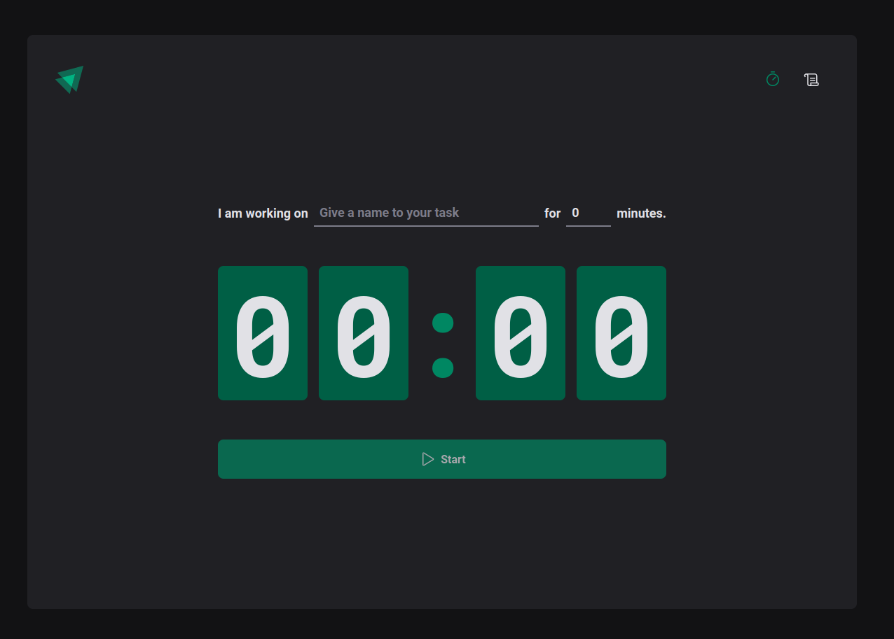
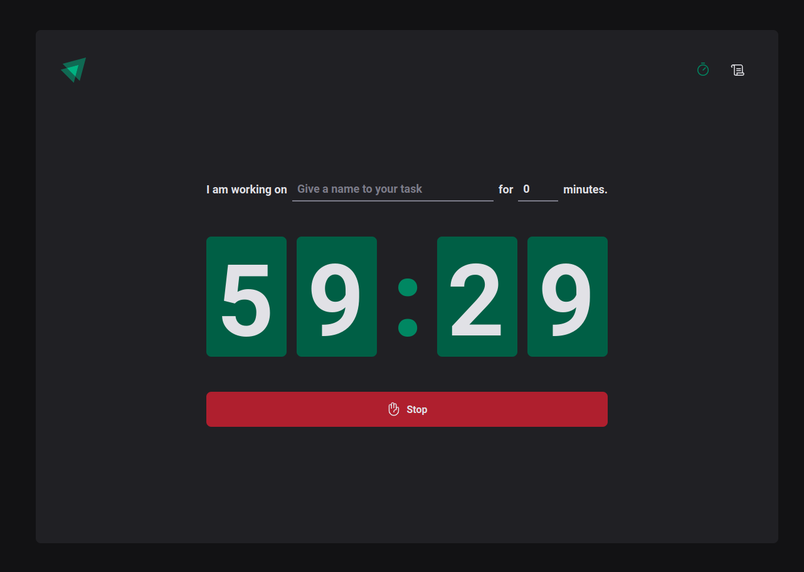
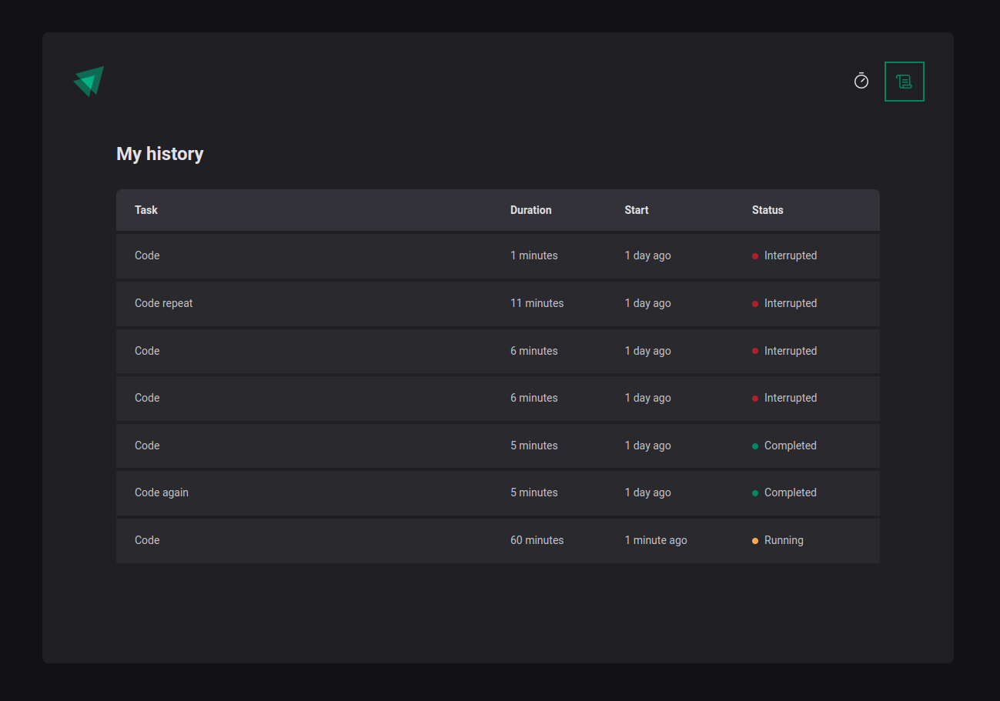

#
<p align="center">
    
</p>
<h1 align="center">Ignite Timer</h1>


<p align="center">
  <a href="#rocket-tecnologias">Tecnologias</a>&nbsp;&nbsp;&nbsp;|&nbsp;&nbsp;&nbsp;
  <a href="#-projeto">Projeto</a>&nbsp;&nbsp;&nbsp;|&nbsp;&nbsp;&nbsp;
  <a href="#-layout">Layout</a>&nbsp;&nbsp;&nbsp;|&nbsp;&nbsp;&nbsp;
</p>
<br>

<p align="center">
    
    
    
</p>

---
## 🚀 Technologies ##

This project was developed using the following technologies:

- [React](https://pt-br.reactjs.org/)
- [Vite](https://vitejs.dev/)
- [TypeScript](https://www.typescriptlang.org/)
- [styled-components](https://styled-components.com/)
- [zod](https://github.com/colinhacks/zod/)
- [immer](https://github.com/immerjs/immer/)
- [Phosphor](https://phosphoricons.com/)
<br>

---

## 📋  Requirements ##

Before starting you need :checkered_flag:, have installed the [Git](https://git-scm.com) e [Node](https://nodejs.org/en/).

<br>

---
## ⌨ How to run the project ##

```bash
# Clone this project
$ git clone git@github.com:Ca-byte/ignite_timer.git

# Access
$ cd ignite-timer

# Install dependencies
$ npm i

# Run the project
$ npm run dev

# The server will initialize in the <http://localhost:5173/>

```
<br>

---

## 💻 Project

We have created a stopwatch and a history of cycles so that the user can record all the activities carried out during the day, with their status as to whether they have been completed, interrupted or are currently taking place. We've used styled components, React Hook Form, Zod, React Router Dom, Context Api, hooks like useReducer, immutability with the tool Immer.

This is a project developed during React bootcamp **[Ignite](https://github.com/Rocketseat)**, run by **[@Rocketseat](https://github.com/Rocketseat)**.

<br>

---

## 🔖 Layout ##

- [Ignite Timer](https://www.figma.com/file/myEkJKJPALMmzY637irtLr/Ignite-Timer-(Community)?node-id=313%3A964&t=jib2LxOeOVFazHTG-0)

Remembering that you need to have a [Figma](http://figma.com/) account to access it.


---


<br>
<p align="center">Developed with 💜 by Caroline Vieira</p>

